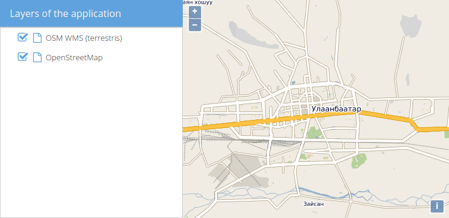
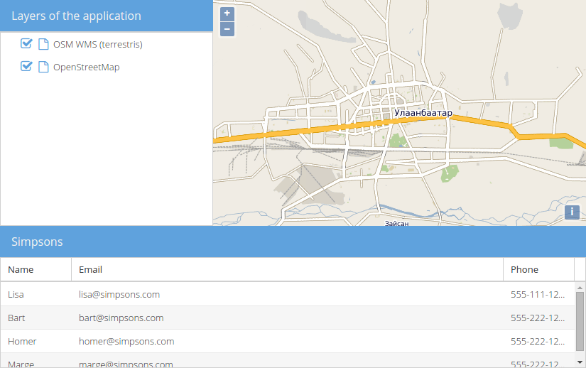
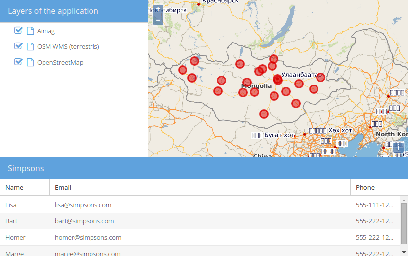

# Prepare layout

We want to add a grid panel to our basic map application now.

## Exercises

* Prepare the `map.html` file to contain the following code. This is basically the result of the previous chapters:

```html
<!DOCTYPE html>
<html>
  <head>
    <meta charset="utf-8" />
    <title>Exercise | GeoExt Workshop</title>
    <link rel="stylesheet" href="https://cdnjs.cloudflare.com/ajax/libs/extjs/6.2.0/classic/theme-triton/resources/theme-triton-all.css" type="text/css" />
    <script src="https://cdnjs.cloudflare.com/ajax/libs/extjs/6.2.0/ext-all.js"></script>
    <link rel="stylesheet" href="./lib/ol/ol.css" type="text/css" />
    <script src="./lib/ol/ol.js"></script>
    <script src="https://geoext.github.io/geoext3/v3.0.0/GeoExt.js"></script>
  </head>
  <body>
    <script>
var map;
Ext.onReady(function(){
  // 1) OpenLayers
  //
  // Create an instance of an OpenLayers map:
  map = new ol.Map({
    layers: [
      new ol.layer.Tile({
        source: new ol.source.OSM(),
        name: 'OpenStreetMap'
      }),
      new ol.layer.Tile({
        source: new ol.source.TileWMS({
          url: 'http://ows.terrestris.de/osm/service',
          params: {
            layers: 'OSM-WMS'
          }
        }),
        name: 'OSM WMS (terrestris)'
      })
    ],
    view: new ol.View({
      center: ol.proj.fromLonLat( [106.92, 47.92] ),
      zoom: 12
    })
  });

  // 2) GeoExt
  //
  // Create an instance of the GeoExt map component with that map:
  var mapComponent = Ext.create('GeoExt.component.Map', {
    map: map,
    region: 'center'
  });

  var treeStore = Ext.create('GeoExt.data.store.LayersTree', {
    layerGroup: map.getLayerGroup()
  });

  var layerTreePanel = Ext.create('Ext.tree.Panel', {
    title: 'Layers of the application',
    width: 300,
    region: 'west',
    store: treeStore,
    rootVisible: false,
    viewConfig: {
      plugins: { ptype: 'treeviewdragdrop' }
    }
  });

  // 3) Ext JS
  //
  // Create a viewport
  var vp = Ext.create('Ext.container.Viewport', {
    layout: 'border',
    items: [
      mapComponent,
      layerTreePanel
    ]
  });
});
    </script>
  </body>
</html>
```

* If you open this file in a browser ([{{ book.exerciseUrl }}/map.html]({{ book.exerciseUrl }}/map.html)), the application should look like in the following image:



* We want to have a grid in the south, so let's start with the basic example from the [ExtJS Grid documentation](http://docs.sencha.com/extjs/6.0/6.0.0-classic/#!/api/Ext.grid.Panel):

```js
Ext.create('Ext.data.Store', {
  storeId: 'simpsonsStore',
  fields:[ 'name', 'email', 'phone'],
  data: [
    { name: 'Lisa', email: 'lisa@simpsons.com', phone: '555-111-1224' },
    { name: 'Bart', email: 'bart@simpsons.com', phone: '555-222-1234' },
    { name: 'Homer', email: 'homer@simpsons.com', phone: '555-222-1244' },
    { name: 'Marge', email: 'marge@simpsons.com', phone: '555-222-1254' }
  ]
});

Ext.create('Ext.grid.Panel', {
  title: 'Simpsons',
  store: Ext.data.StoreManager.lookup('simpsonsStore'),
  columns: [
    { text: 'Name', dataIndex: 'name' },
    { text: 'Email', dataIndex: 'email', flex: 1 },
    { text: 'Phone', dataIndex: 'phone' }
  ],
  height: 200,
  width: 400,
  renderTo: Ext.getBody()
});
```

* Instead of using a `storeId` and then later <code>Ext.data.StoreManager.lookup(&#39;simpsonsStore&#39;)</code>, we will simply use a variable to be able to reference the store. Since we will put the panel in our border layout, we do not need the `renderTo` and `width` properties. Don't forget to assign the `region: south`. We'll also save the panel in a variable. Your code should look roughly like the following:

```js
var featureStore = Ext.create('Ext.data.Store', {
  fields:[ 'name', 'email', 'phone'],
  data: [
    { name: 'Lisa', email: 'lisa@simpsons.com', phone: '555-111-1224' },
    { name: 'Bart', email: 'bart@simpsons.com', phone: '555-222-1234' },
    { name: 'Homer', email: 'homer@simpsons.com', phone: '555-222-1244' },
    { name: 'Marge', email: 'marge@simpsons.com', phone: '555-222-1254' }
  ]
});

var featurePanel = Ext.create('Ext.grid.Panel', {
  title: 'Simpsons',
  store: featureStore,
  columns: [
    { text: 'Name', dataIndex: 'name' },
    { text: 'Email', dataIndex: 'email', flex: 1 },
    { text: 'Phone', dataIndex: 'phone' }
  ],
  height: 200,
  region: 'south'
});
```

* Once we have added the `featurePanel` to the viewport, our application should look like in the following image:



* Of course we also want to have a vector layer in the map, whose features we want in the grid later.

* Please create a new `ol.layer.Vector`, that has a `ol.source.GeoJSON` configured and loads the local data in `src/exercises/data/aimag-centers.json`. Please style the points with red circles. Please also zoom the map a little bit further out; zoom level `4` should be fine.

```js
var redStyle = new ol.style.Style({
  image: new ol.style.Circle({
    fill: new ol.style.Fill({
      color: 'rgba(220, 0, 0, 0.5)'
    }),
    stroke: new ol.style.Stroke({
      color: 'rgba(220, 0, 0, 0.8)',
      width: 3
    }),
    radius: 8
  })
});
var vectorLayer = new ol.layer.Vector({
  source: new ol.source.Vector({
    url: 'data/aimag-centers.json',
    format: new ol.format.GeoJSON()
  }),
  name: 'Aimag',
  style: redStyle
});
```

* Our application should now look like in the following image:


