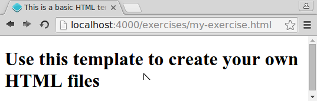
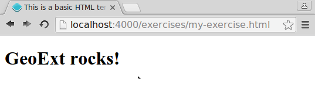

# Hello exercise

Throughout this workshop, you will encounter various tasks, that you should
accomplish. Most of the time you will be asked to edit an HTML or JavaScript-file
and see if the result is as intended.

In order to have comparable results, you are advised to save your HTML and any
additional files inside of the `src/exercises/`-folder. If you followed the
instructions for setting up the [development environment](../meta/development-environment.md),
this folder will be located at:

`~/gx-ws/geoext3-ws-master/src/exercises`.

If you e.g. store a file named `map.html` inside this directory, and you are
serving the workshop as recommended, than this file can be accessed via the
following URL:

[{{ book.exerciseUrl }}/map.html]({{ book.exerciseUrl }}/map.html)

Shall we tackle our first tiny exercise? OK then, here we go:

## Exercises

* Create a `my-exercise.html` HTML-file in the `src/exercises/`-folder, open it
  with your text editor and fill it with the template HTML from below:

```html
<!DOCTYPE html>
<html>
  <head>
    <meta charset="utf-8" />
    <title>This is a basic HTML template</title>
  </head>
  <body>
    <h1>Use this template to create your own HTML files</h1>
  </body>
</html>
```

* See if your file is available in a browser under the following URL:
  [{{ book.exerciseUrl }}/my-exercise.html]({{ book.exerciseUrl }}/my-exercise.html)
* In the body of the HTML change the content of the first `<h1>`-element to
  read: `GeoExt rocks!`
* Check if any changes to the HTML file are reflected in your browser. Reload
  the URL  [{{ book.exerciseUrl }}/my-exercise.html]({{ book.exerciseUrl }}/my-exercise.html)

If everything worked, you should see something like in the following images.





> **info** **Please note:**
>
> In case you added more files (e.g.for upcoming tasks) to the
> `src/exercises/` folder and they are *not* instantly available under the
> URL [{{ book.exerciseUrl }}/filename.html]({{ book.exerciseUrl }}/filename.html)
>
> … then you have to stop and start the fileserving again. See the
> [notes on starting / stopping](../meta/development-environment.md)
> (Hint: `Ctrl-C` or `npm start`)
