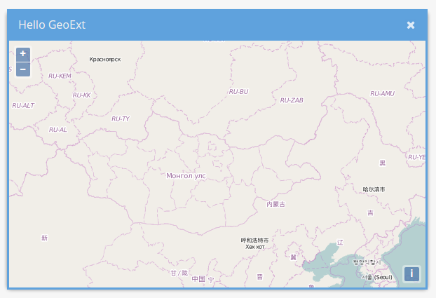

# Hello GeoExt

Now that we know how to use OpenLayers and ExtJS, it's time to join these libraries. Enter **GeoExt**!

We'll start with the result of the last exercise, which was a basic HTML file that included the resources to ExtJS.

## Exercises

* Copy the following HTML into a file `hello-geoext.html` in the `exercises`-directory:

```html
<!DOCTYPE html>
<html>
  <head>
    <meta charset="utf-8" />
    <title>This is a basic HTML template</title>
    <link rel="stylesheet" href="https://cdnjs.cloudflare.com/ajax/libs/extjs/6.2.0/classic/theme-triton/resources/theme-triton-all.css" type="text/css" />
    <script src="https://cdnjs.cloudflare.com/ajax/libs/extjs/6.2.0/ext-all.js"></script>
  </head>
  <body>
    <script>
Ext.onReady(function(){
  var win = Ext.create('Ext.window.Window', {
    width: 200,
    height: 200,
    title: 'ExtJS …',
    html: '… is easy!'
  });
  win.show();
});
    </script>
  </body>
</html>
```

* Add the CSS and JavaScript for OpenLayers:

```html
<link rel="stylesheet" href="./lib/ol/ol.css" type="text/css" />
<script src="./lib/ol/ol.js"></script>
```

* Add the JavaScript for GeoExt: `https://geoext.github.io/geoext3/master/GeoExt.js`

* Most GeoExt components don't need special CSS. If you use the `Popup`-components, you may want to include the following CSS file: `http://geoext.github.io/geoext3/master/resources/css/gx-popup.css`

* Verify that [{{ book.exerciseUrl }}/hello-geoext.html]({{ book.exerciseUrl }}/hello-geoext.html) loads in your browser

# Adding our first GeoExt component

## Exercises

* We are now going to create an instance of `GeoExt.component.Map` and render it in the window we created in the previous example.
* In order to do that:
  * Remove the `html: '…is easy!'` from the `Ext.window.Window` configuration object
  * And add the following lines instead:
    ```javascript
    // in the config object:
    layout: 'fit',
    items: [
      Ext.create('GeoExt.component.Map', {
        map: new ol.Map({
          layers: [
            new ol.layer.Tile({
              source: new ol.source.OSM()
            })
          ],
          view: new ol.View({
            center: ol.proj.fromLonLat([106.92, 47.92]),
            zoom: 4
          })
        })
      })
    ]
   ```
* Next: Please change the title of the window and make is slightly bigger.

If your example looks like the one below, everything is set up correctly!


