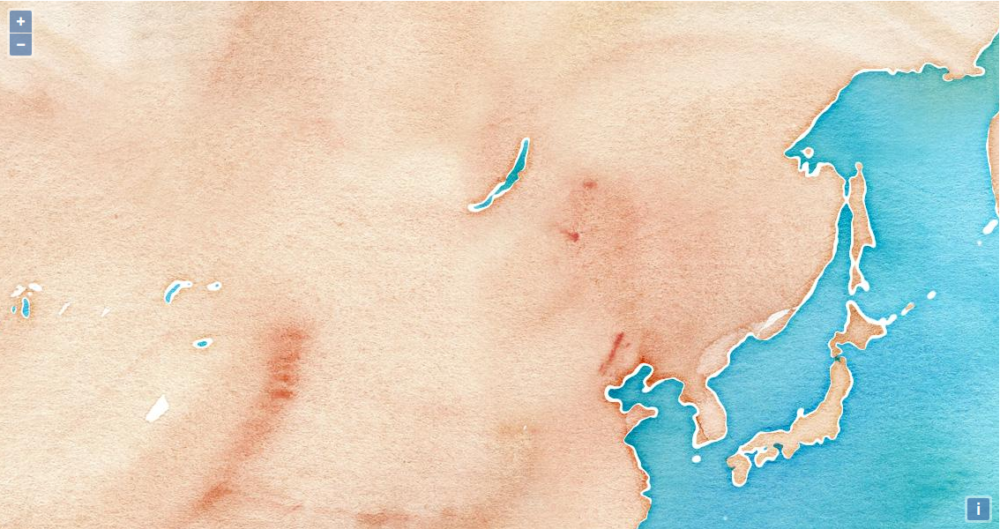
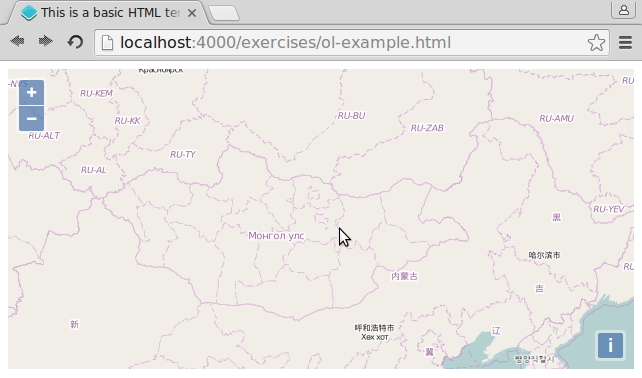

# Hello OpenLayers

Ok, we can create and edit HTML-files, and we can see the changes in our browser because all files in `src/exercises/` are always avalaible under {{ book.exerciseUrl }}.

Let's see how we can include OpenLayers in our page so that we can start to use it. In order to do so, we need to include a CSS and a JavaScript file.

## Exercises

* See if you find a folder `lib/ol/` inside of the `src/exercise/`-folder. It should contain two files: `ol.js` and `ol.css`
* Create a new `ol-example.html` from the basic template

[import](../snippets/template.html)

* Change `ol-example.html` to include both files in the  `<head>`. Use the below templates to include a CSS and a JavaScript file.

[import](../snippets/include-js-css.html)

* Verify that {{ book.exerciseUrl }}/ol-example.html loads your file.

* In the  `<body>` of the file, add the following HTML-fragment, which includes a tiny bit of JavaScript:

[import](../snippets/simple-map.html)

* When you now reload the {{ book.exerciseUrl }}/ol-example.html URL, you should see an OpenLayers map centered on Ulan Bator:



* To verify we are really looking at Ulan Bator, just change the layers to now consist of an OpenStreetmap layer, which e.g. has labels and a country outline. Use the following JavaScript snippet at the appropriate place:

```js
new ol.layer.Tile({
  source: new ol.source.OSM()
})
```


