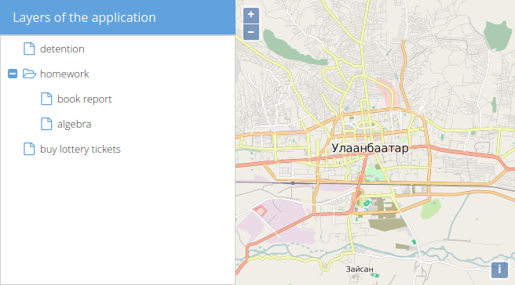

# Create a TreePanel

We now have the layout prepared and simply need to switch the contents of the west-panel.

Since we want to use a tree to eventually control the layers of the map, we'll use an  `Ext.tree.Panel` instead of the simple panel.

## Exercises

* Next, we'll switch out the `Ext.panel.Panel` against a dedicated `Ext.tree.Panel`. If we look at the documentation for the [tree-panel](http://docs.sencha.com/extjs/6.0.0-classic/Ext.tree.Panel.html), you'll see a very basic example, which you please add to the viewport instead of our placeholder.

* The example from the above page looks like this:

```js
var store = Ext.create('Ext.data.TreeStore', {
  root: {
    expanded: true,
    children: [
      { text: 'detention', leaf: true },
      { text: 'homework', expanded: true, children: [
        { text: 'book report', leaf: true },
        { text: 'algebra', leaf: true}
      ] },
      { text: 'buy lottery tickets', leaf: true }
    ]
  }
});

Ext.create('Ext.tree.Panel', {
  title: 'Simple Tree',
  width: 200,
  height: 150,
  store: store,
  rootVisible: false,
  renderTo: Ext.getBody()
});
```

* Try to understand what each line of the above code does and see which lines you need to change or remove, so that you can use the tree in our layout.

* Some hints (in case you have trouble getting it to work)

  * The store &mdash; as complicated as it looks at first &mdash; can be left as is, you don't need to change something here.
  * The return value of the `Ext.create('Ext.tree.Panel', /**/)` call is currently ignored. You should try to save it in a variable (probably the one from our basic setup `layerTreePanel`).
  * The height of the tree-panel is unnecessary, we want to put the panel in the west region, which has full height by default. Remove the `height`-property.
  * The `renderTo`-configuration of the tree-panel is also fine for the ExtJS standalone example, but bad for our combination setup. In our case, the viewport takes care of where to actually render the tree. Remove the `renderTo`-property.
  * Don't forget to add the `region`-property to the tree-panel and set it to 'west', so the tree-panel gets rendered properly in the border-layout of the viewport.

* The final result should look like this:



* For reference, here is the full code of the store, tree and viewport that lead to the above picture:

```js
var store = Ext.create('Ext.data.TreeStore', {
  root: {
    expanded: true,
    children: [
      { text: 'detention', leaf: true },
      { text: 'homework', expanded: true, children: [
        { text: 'book report', leaf: true },
        { text: 'algebra', leaf: true}
      ] },
      { text: 'buy lottery tickets', leaf: true }
    ]
  }
});

var layerTreePanel = Ext.create('Ext.tree.Panel', {
  title: 'Layers of the application',
  width: 300,
  region: 'west',
  store: store,
  rootVisible: false
});

var vp = Ext.create('Ext.container.Viewport', {
  layout: 'border',
  items: [
    mapComponent,
    layerTreePanel
  ]
});
```
