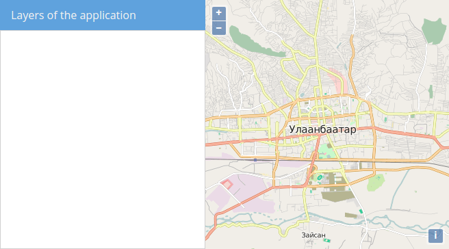

# Prepare layout

The previous chapter started from the following template, which we now want to recreate.

## Exercises

* Please create a file `map.html` in the `src/exercises` directory and paste the following:

```html
<!DOCTYPE html>
<html>
  <head>
    <meta charset="utf-8" />
    <title>Exercise | GeoExt Workshop</title>
    <link rel="stylesheet" href="https://cdnjs.cloudflare.com/ajax/libs/extjs/6.2.0/classic/theme-triton/resources/theme-triton-all.css" type="text/css" />
    <script src="https://cdnjs.cloudflare.com/ajax/libs/extjs/6.2.0/ext-all.js"></script>
    <link rel="stylesheet" href="./lib/ol/ol.css" type="text/css" />
    <script src="./lib/ol/ol.js"></script>
    <script src="https://geoext.github.io/geoext3/v3.0.0/GeoExt.js"></script>
  </head>
  <body>
    <script>
var map;
Ext.onReady(function(){
  // 1) OpenLayers
  //
  // Create an instance of an OpenLayers map:
  map = new ol.Map({
    layers: [
      new ol.layer.Tile({
        source: new ol.source.OSM()
      })
    ],
    view: new ol.View({
      center: ol.proj.fromLonLat( [106.92, 47.92] ),
      zoom: 12
    })
  });

  // 2) GeoExt
  //
  // Create an instance of the GeoExt map component with that map:
  var mapComponent = Ext.create('GeoExt.component.Map', {
    map: map
  });

  // 3) Ext JS
  //
  // Create a viewport
  var vp = Ext.create('Ext.container.Viewport', {
    layout: 'fit',
    items: mapComponent
  });
});
    </script>
  </body>
</html>
```

* We want to change the layout of the viewport as follows:

```js
var vp = Ext.create('Ext.container.Viewport', {
  layout: 'border',
  items: [
    mapComponent
  ]
});
```

* In order to be usable in a border-layout, one child component needs to have the `region`-property set to `center`:

```js
var mapComponent = Ext.create('GeoExt.component.Map', {
  map: map,
  region: 'center'
});
```

* If you apply the above changes, your application should render again in the browser, but since we only have one component in the border-layout, you'll not notice a visual difference.

* Let's first add a placeholder panel where we want to add the layer tree:

```js
var layerTreePanel = Ext.create('Ext.panel.Panel', {
  title: 'Layers of the application',
  width: 300,
  region: 'west'
});
// … this panel also needs to be added to the viewport
var vp = Ext.create('Ext.container.Viewport', {
  layout: 'border',
  items: [
    mapComponent,
    layerTreePanel
  ]
});
```

* Your application should now look like the following:


