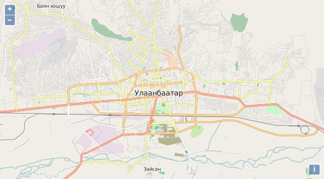

# Basic example

We want to have a look at a fully working example first.

## Exercises

* Create a new file `map.html` in the `src/exercise`-directory.
* Paste the following html-code into the file you have just created:
```html
<!DOCTYPE html>
<html>
    <head>
      <meta charset="utf-8" />
      <title>Exercise | GeoExt Workshop</title>
      <link rel="stylesheet" href="https://cdnjs.cloudflare.com/ajax/libs/extjs/6.2.0/classic/theme-triton/resources/theme-triton-all.css" type="text/css" />
      <script src="https://cdnjs.cloudflare.com/ajax/libs/extjs/6.2.0/ext-all.js"></script>
      <link rel="stylesheet" href="./lib/ol/ol.css" type="text/css" />
      <script src="./lib/ol/ol.js"></script>
      <script src="https://geoext.github.io/geoext3/v3.0.0/GeoExt.js"></script>
    </head>
    <body>
      <script>
        var map;
        Ext.onReady(function(){
          // 1) OpenLayers
          //
          // Create an instance of an OpenLayers map:
          map = new ol.Map({
            layers: [
              new ol.layer.Tile({
                source: new ol.source.OSM()
              })
            ],
            view: new ol.View({
              center: ol.proj.fromLonLat( [106.92, 47.92] ),
              zoom: 12
            })
          });

          // 2) GeoExt
          //
          // Create an instance of the GeoExt map component with that map:
          var mapComponent = Ext.create('GeoExt.component.Map', {
            map: map
          });

          // 3) Ext JS
          //
          // Create a viewport
          var vp = Ext.create('Ext.container.Viewport', {
            layout: 'fit',
            items: mapComponent
          });
        });
      </script>
    </body>
</html>
```

* Verify that [{{ book.exerciseUrl }}/map.html]({{ book.exerciseUrl }}/map.html) loads in your browser and looks like the picture below.



We will now [dissect the example](dissecting-example.md) and explain what each part does.
