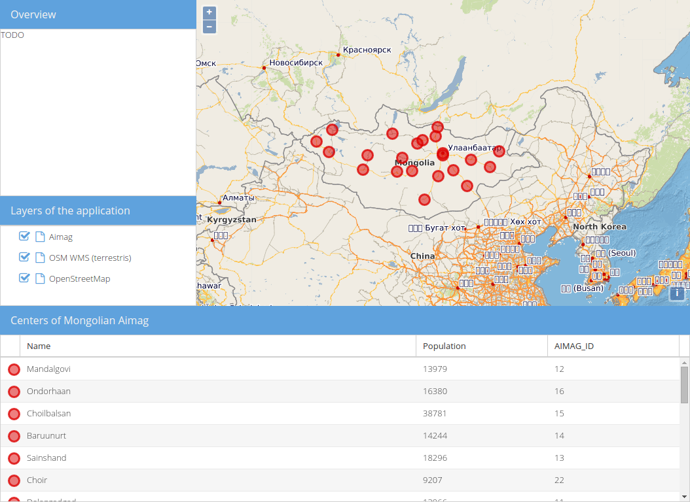

# Overview map

Especially when zoomed in, it can be hard to understand the extent of the mappanel. Overview-maps, which show the extent of the main map on a smaller scale can be very useful then. GeoExt comes with a useful component to create overviews: `GeoExt.component.OverviewMap`.

## Exercises

* We'll start again with the code of `map.html` from the previous sections. It's already some lines long:

```html
<!DOCTYPE html>
<html>
    <head>
        <meta charset="utf-8">
        <title>Exercise | GeoExt Workshop</title>
        <link rel="stylesheet" href="https://cdnjs.cloudflare.com/ajax/libs/extjs/6.0.0/classic/theme-triton/resources/theme-triton-all.css" type="text/css">
        <script src="https://cdnjs.cloudflare.com/ajax/libs/extjs/6.0.0/ext-all.js" type="text/javascript"></script>
        <link rel="stylesheet" href="./lib/ol/ol.css" type="text/css">
        <link rel="stylesheet" href="http://geoext.github.io/geoext3/master/resources/css/gx-popup.css" type="text/css">
        <script src="./lib/ol/ol.js" type="text/javascript"></script>
        <script src="https://geoext.github.io/geoext3/master/GeoExt.js" type="text/javascript"></script>
        <style>
.gx-popup p {
    padding: 5px 5px 0 5px;
    border-radius: 7px;
    background-color: rgba(255,255,255,0.85);
    border: 3px solid white;
    margin: 0;
    text-align: center;
}
        </style>
    </head>
    <body>
        <script>
var map;
Ext.onReady(function(){

    var redStyle = new ol.style.Style({
        image: circle = new ol.style.Circle({
            fill: new ol.style.Fill({
                color: 'rgba(220, 0, 0, 0.5)'
            }),
            stroke: new ol.style.Stroke({
                color: 'rgba(220, 0, 0, 0.8)',
                width: 3
            }),
            radius: 8
        })
    });
    var blueStyle = new ol.style.Style({
        image: circle = new ol.style.Circle({
            fill: new ol.style.Fill({
                color: 'rgba(0, 0, 220, 0.5)'
            }),
            stroke: new ol.style.Stroke({
                color: 'rgba(0, 0, 220, 0.8)',
                width: 3
            }),
            radius: 8
        })
    })


    var vectorLayer = new ol.layer.Vector({
        source: new ol.source.Vector({
            url: 'data/aimag-centers.json',
            format: new ol.format.GeoJSON()
        }),
        name: 'Aimag',
        style: redStyle
    });

    // 1) OpenLayers
    //
    // Create an instance of an OpenLayers map:
    map = new ol.Map({
        layers: [
            new ol.layer.Tile({
                source: new ol.source.OSM(),
                name: 'OpenStreetMap'
            }),
            new ol.layer.Tile({
                source: new ol.source.TileWMS({
                    url: 'http://ows.terrestris.de/osm/service',
                    params: {
                        layers: 'OSM-WMS'
                    }
                }),
                name: 'OSM WMS (terrestris)'
            }),
            vectorLayer
        ],
        view: new ol.View({
            center: ol.proj.fromLonLat( [106.92, 47.92] ),
            zoom: 4
        })
    });

    // 2) GeoExt
    //
    // Create an instance of the GeoExt map component with that map:
    var mapComponent = Ext.create('GeoExt.component.Map', {
        map: map,
        region: 'center',
        pointerRest: true,
        pointerRestInterval: 750,
        pointerRestPixelTolerance: 5
    });

    var popup = Ext.create('GeoExt.component.Popup', {
        map: map,
        width: 200
    });

    // Add a pointerrest handler to the map component to render the popup.
    mapComponent.on('pointerrest', function(evt) {
        var coordinate = evt.coordinate;
        var lonlat = ol.proj.transform(coordinate, 'EPSG:3857', 'EPSG:4326')
        var hdms = ol.coordinate.toStringHDMS(lonlat);
        popup.setHtml('<p>' + hdms + '</p>');
        popup.position(coordinate);
        popup.show();
    });

    // hide the popup once it isn't on the map any longer
    mapComponent.on('pointerrestout', popup.hide, popup);

    var treeStore = Ext.create('GeoExt.data.store.LayersTree', {
        layerGroup: map.getLayerGroup()
    });

    var layerTreePanel = Ext.create('Ext.tree.Panel', {
        title: 'Layers of the application',
        width: 300,
        region: 'west',
        store: treeStore,
        rootVisible: false,
        viewConfig: {
            plugins: { ptype: 'treeviewdragdrop' }
        }
    });

    var featureStore = Ext.create('GeoExt.data.store.Features', {
        layer: vectorLayer,
        map: map
    });
    var featureGrid = Ext.create('Ext.grid.Panel', {
        store: featureStore,
        region: 'south',
        title: 'Centers of Mongolian Aimag',
        columns: [
            {xtype: 'gx_symbolizercolumn', width: 30},
            {text: 'Name', dataIndex: 'NAME', flex: 3},
            {text: 'Population', dataIndex: 'POP', flex: 1},
            {text: 'AIMAG_ID', dataIndex: 'AIMAG_ID', flex: 1}
        ],
        listeners: {
            selectionchange: function(sm, selected) {
                // reset all selections
                featureStore.each(function(rec) {
                    rec.getFeature().setStyle(null);
                });
                // highlight grid selection in map
                Ext.each(selected, function(rec) {
                    rec.getFeature().setStyle(blueStyle);
                });
                // update the grid rendering of the geometry
                sm.view.refresh();
            }
        },
        height: 300
    });

    // 3) Ext JS
    //
    // Create a viewport
    var vp = Ext.create('Ext.container.Viewport', {
        layout: 'border',
        items: [
            mapComponent,
            layerTreePanel,
            featureGrid
        ]
    });
});
        </script>
    </body>
</html>
```

* If you open this file in a browser ({{ book.exerciseUrl }}/map.html), the application should look like in the following image, but you should also be able to see popups when hovering over a map location:


* We want the overview map to live in the top-left corner of our application, right above the layer tree. For this we will &mdash; as usual &mdash; first prepare the layout before we use the GeoExt component.

* Create a new panel that we will eventually replace with the overview, but don't add it anywhere yet:

```js
var overviewPanel = Ext.create('Ext.panel.Panel', {
    title: 'Overview',
    layout: 'fit',
    html: 'TODO',
    height: 300,
    width: 300
});
```

* Instead of assigning the `region: 'west'` to the layer tree panel, we'll create a new `container` with the `vbox`-layout and pass that to the `items` of the `Ext.container.Viewport`:

```js
var vp = Ext.create('Ext.container.Viewport', {
    layout: 'border',
    items: [
        mapComponent,
        // below is the new wrapping container:
        {
            xtype: 'container',
            region: 'west',
            layout: 'vbox',
            collapsible: true,
            items: [
                overviewPanel,
                layerTreePanel
            ]
        },
        featureGrid
    ]
});
```

* If we specify `flex: 1` for the `layerTreePanel` (the `region`-property is no longer needed), your application should look like this:



* Now it is time to use `GeoExt.component.OverviewMap`: Create an instance of this class and read the [related API-docs](http://geoext.github.io/geoext3/master/docs/#!/api/GeoExt.component.OverviewMap).

* Configure the `overviewPanel` with the created overview instead of `html: 'TODO'` (via `items`).

* You may want to have another layer in the overview. How about this WMS?

```
URL: http://ows.terrestris.de/osm-gray/service
Layers: OSM-WMS
```

* <button class="section" target="hint1" show="Show hint" hide="Hide hint"></button>

<!--sec data-title="Hint" data-id="hint1" data-show=false ces-->
```js
var overview = Ext.create('GeoExt.component.OverviewMap', {
    parentMap: map,
    layers: [
        new ol.layer.Tile({
            source: new ol.source.TileWMS({
                url: 'http://ows.terrestris.de/osm-gray/service',
                params: {
                    layers: 'OSM-WMS'
                }
            }),
            opacity: 0.8
        })
    ]
});
var overviewPanel = Ext.create('Ext.panel.Panel', {
    title: 'Overview',
    layout: 'fit',
    items: overview,
    height: 300,
    width: 300,
    collapsible: true
});
```
<!--endsec-->

* If everything went well, you should see an application like below:


